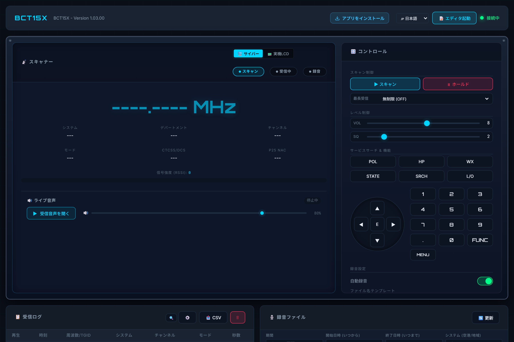
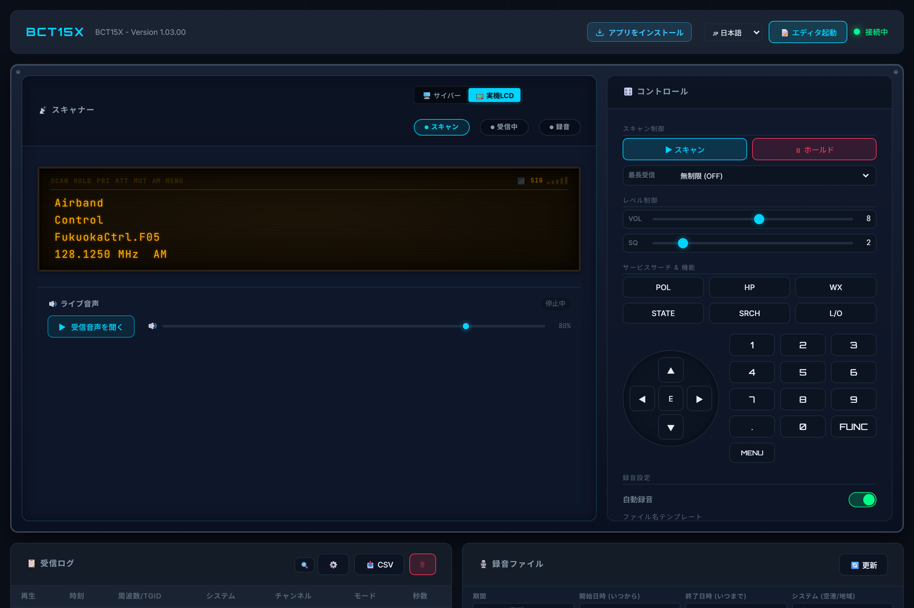
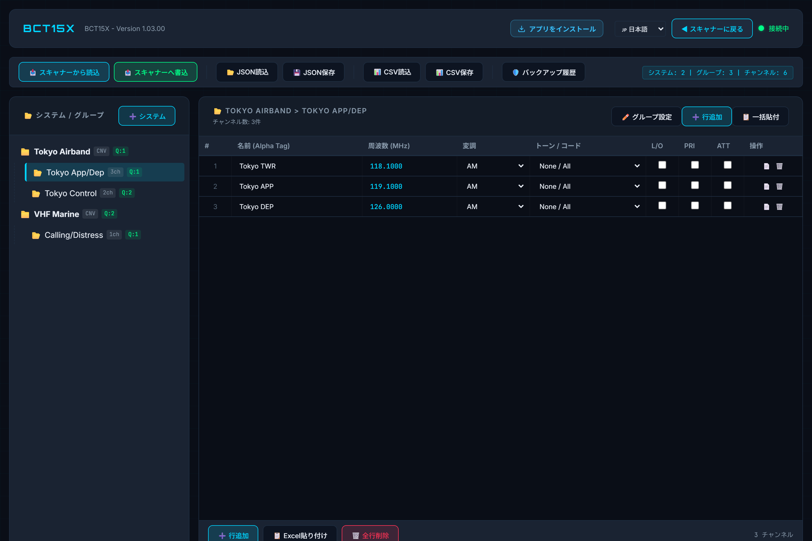

# Uniden Web Remote & Memory Manager (`uniden-web-remote`)

[English](README.md) | [日本語]

Uniden スキャナー（BCT15X および互換 DMA 機種）を USB シリアル経由でリモート制御し、受信音声をリアルタイム配信・自動録音できる Web アプリケーション。
Docker 上で軽快に動作し、ブラウザからスキャナーの操作や、**本格的なスプレッドシート型メモリプログラミング**が行えます。
多言語対応（日本語・English）を標準搭載しています。

<p align="center">
  
</p>

---

## 🎯 設計思想・想定される利用形態

本プロジェクトは、手元のローカルPCにスキャナーを直結して操作する既存のアプリケーションとは異なり、**「家庭内サーバー等にスキャナーを接続してバックグラウンドで常時録音させつつ、リモートで手軽に視聴・操作できればよい」** という思想のもとに設計されています。

**24時間365日の常時録音・安定稼働、Dockerコンテナ化による構築の手軽さ、Webブラウザさえあればどこからでもアクセスできる柔軟性**を最優先としつつ、WebSocket と Web Audio API を活用することで、**ブラウザ環境でありながら実機とほぼタイムラグのない超低遅延（100〜300ms）な受信体験**を実現しています。

- **想定する運用スタイル**:
  家庭内サーバーや小型PC、Linux ボックス、Raspberry Pi 等で Docker コンテナを常時稼働させ、同一 LAN 内の各端末（自室のPC、ノートPC、タブレット、スマートフォン等）から `http://<サーバーのローカルIP>:3000` にアクセスして利用することを想定しています（もちろん、単一PC上での `http://localhost:3000` 運用も可能です）。

---

## ⚡ 超低遅延ライブ音声とリアルタイム同期

- **WebSocket ＋ Web Audio API による極小遅延（100〜300ms）**:
  ブラウザ標準の `<audio>` 要素による数秒のバッファリングを排し、WebSocket で raw PCM を直接プッシュして Web Audio API (`AudioContext`) で即時再生します。
- **画面表示と音声の完全同期**:
  スキャナーのスケルチが開いた瞬間やチャンネル切り替え（Hold/Scan/Temporary Lockout等）の操作と、スピーカーから聞こえる音声がほぼ完全に一致します。
- **自動ドリフト追従**:
  ネットワークの一時的なゆらぎ等でバッファが蓄積した場合も、自動で最新フレームへ追いつくため、長時間聴き続けても遅延が一切累積しません。

---

### 📻 対応機種
- **動作検証済み**: **Uniden Bearcat BCT15X**
- **プロトコル互換性**: Uniden DMA（Dynamic Memory Architecture）シリアルプロトコルに準拠して設計されています。同系統のコマンド体系を持つ **BCD996XT**, **BCD996P2**, **BCD396XT**, **BCD325P2**, **BC346XT** 等でも同様に動作、または少数の調整で対応可能です。（コミュニティからの動作報告やプルリクエストを歓迎します！）

---

## 🌟 主な画面と機能 (Community Edition / オープンソース)

### 1. 📡 リアルタイム操作ダッシュボード
周波数/TGID、システム/グループ/チャンネル名、変調方式、CTCSS/DCS トーン、RSSI 信号強度メーターのリアルタイム表示に加え、フルキーパッド・ロータリーノブ操作、超低遅延ライブ音声、自動録音ファイルの再生・検索がワンストップで行えます。

お好みに応じてワンクリックで 2つの表示モード を切り替え可能です：
- **🖥️ サイバー大画面モード**: 視認性に優れた大型ネオン周波数表示とシグナルメーター
- **📟 実機風 仮想LCDモード**: 実機のオレンジバックライト液晶を忠実に再現したクラシックスタイル

<p align="center">
  
  <em>▲ 実機風 仮想LCD表示モード（メニュー操作や実機さながらの表示に対応）</em>
</p>

### 2. 📝 本格スプレッドシート型メモリエディタ
Webブラウザ上で動作する本格的なチャンネルメモリ管理機能です。
- **実機 DMA プロトコル同期**: 実機の全システム・グループ・チャンネルを一括読み出し＆書き込み
- **スプレッドシート型グリッド編集**: 表計算ソフトのように周波数や変調、トーン、アッテネータ、優先設定をインライン編集
- **Excel / テキスト一括貼り付け**: 周波数リストを Excel や Google スプレッドシートからコピーして一括インポート
- **安全バックアップ機能**: 実機への書き込み時に自動でローカルバックアップ JSON を作成、過去履歴からワンクリックで復元可能
- **CSV / JSON エクスポート＆インポート**: 外部ファイルとの自由なバックアップ・移行に対応

<p align="center">
  
  <em>▲ スプレッドシート型メモリエディタ（Excel一括貼り付け・実機DMA同期対応）</em>
</p>

### 3. その他充実の機能
- 🎙️ **自動録音**: 信号受信時に自動で MP3 録音、ヒットごとにファイル分割・ブラウザ再生・ダウンロード
- 📋 **受信ログ**: 受信時刻、周波数、システム名等の履歴記録と CSV 出力
- 🌐 **多言語対応 (i18n)**: 🇯🇵 日本語 / 🇺🇸 English をワンクリックでシームレスに切り替え
- 📱 **PWA (Progressive Web App) 対応**: スマホ（iOS/Android）やPCでホーム画面に追加し、ブラウザ枠のない専用スタンドアロンアプリとして起動可能
- 🖥️ **モックモード**: 実機なしでの UI 開発・デモ体験

---

## 🚀 クイックスタート

### 1. ハードウェア接続

- BCT15X フロント端子 ──(USBシリアルケーブル)──> PC/ホスト Linux
- BCT15X ヘッドホン端子 ──(オーディオケーブル)──> PC ライン入力または USB オーディオデバイス

```bash
# USBシリアルデバイスの確認
ls /dev/ttyUSB*

# 録音デバイスの確認
arecord -l
```

```

### 2. 環境変数の設定 (`.env`)

本システムでは、シリアルポートやサウンドデバイス、認証パスワードなどの設定を `.env` ファイルで一元管理できます。
リポジトリ直下のサンプルファイルをコピーして設定を作成してください：

```bash
cp .env.example .env
nano .env  # お好みのエディタで編集
```

※ `.env` ファイルを作成しない場合でも、`docker-compose.yml` に定義されたデフォルト値でそのまま起動できます。

### 3. 起動 (Docker Compose)

```bash
# リポジトリのディレクトリに移動
cd "Remote for docker"

# ビルド＆起動
docker compose up -d --build

# ログ確認
docker compose logs -f scanner
```

ブラウザでアクセスします：
- **家庭内サーバー等の別端末から利用する場合 (推奨・想定環境)**:
  `http://<サーバーのローカルIP>:3000` (例: `http://192.168.1.50:3000`)
- **サーバー自身で開く場合**:
  `http://localhost:3000`

---

## ⚙️ 環境変数設定一覧

`.env` または `docker-compose.yml` でカスタマイズ可能な全設定項目です。

### 接続・ハードウェア設定
| 変数名 | デフォルト値 | 説明 |
|:---|:---|:---|
| `SERIAL_PORT` | `/dev/ttyUSB0` | BCT15X シリアルポートパス (`dmesg` や `ls /dev/ttyUSB*` で確認) |
| `SERIAL_BAUD` | `115200` | シリアル通信速度 (bps)。本体の `Set Serial Port` 設定と一致させてください |
| `AUDIO_DEVICE` | `plughw:1,0` | ALSA 録音デバイス名 (`arecord -l` でカード・デバイス番号を確認) |

### 録音・音質設定 (省サイズ最適化)
| 変数名 | デフォルト値 | 説明 |
|:---|:---|:---|
| `AUDIO_FORMAT` | `mp3` | 録音フォーマット (`mp3`) |
| `AUDIO_SAMPLE_RATE` | `16000` | サンプリングレート (Hz)。無線音声に特化し 16,000Hz で最適化 |
| `AUDIO_CHANNELS` | `1` | チャンネル数 (1: モノラル / 2: ステレオ) |
| `AUDIO_BITRATE` | `32` | MP3 ビットレート (kbps)。人の声の明瞭度を保ちつつ容量を約50%削減 (約14.4MB/時) |
| `AUTO_RECORD` | `true` | スケルチ開口時の自動録音 (`true` / `false`) |
| `SILENCE_THRESHOLD` | `1.0` | SoX の無音検知しきい値 (%) |
| `SILENCE_DURATION` | `3.0` | 録音終了とみなす無音継続時間 (秒) |
| `FILENAME_TEMPLATE` | `{system}/{department}/{channel}/{date}_{time}_{freq}` | 録音ファイル名・階層テンプレート (`/` でサブフォルダ自動生成) |

### 自動リテンション設定 (ストレージ保護)
| 変数名 | デフォルト値 | 説明 |
|:---|:---|:---|
| `RETENTION_DAYS` | `30` | 録音ファイルの保存日数。超過ファイルは自動削除 (`0` で無期限保存) |
| `MAX_STORAGE_MB` | `0` | 録音フォルダの最大容量 (MB)。上限超過時に古い録音から自動パージ (`0` で無制限) |
| `CLEANUP_INTERVAL_HOURS` | `12` | クリーンアップ定期ジョブの実行間隔 (時間) |

### アクセス認証設定 (ロール分離)
| 変数名 | デフォルト値 | 説明 |
|:---|:---|:---|
| `AUTH_ENABLED` | `false` | 認証の有効化 (`true` でロール分離を強制。`false` 時は誰でも全操作可能) |
| `OPERATOR_PASSWORD`| (未設定) | オペレーター権限パスワード (キー操作、スキャナ制御、メモリ編集、録音削除が可能) |
| `LISTENER_PASSWORD`| (未設定) | リスナー権限パスワード (画面閲覧・音声聴取のみ可能。空欄時は誰でも聴取可能) |
| `AUTH_SECRET` | (自動生成) | セッショントークン署名用の秘密鍵 |

### 制御・システム設定
| 変数名 | デフォルト値 | 説明 |
|:---|:---|:---|
| `POLL_INTERVAL` | `200` | 高速状態取得 (GLG) のポーリング間隔 (ms) |
| `STATUS_INTERVAL` | `1000` | 詳細状態取得 (STS) のポーリング間隔 (ms) |
| `RECEPTION_TIMEOUT`| `1500` | 信号途絶判定までのタイムアウトしきい値 (ms) |
| `MAX_RECEPTION_DURATION_SEC` | `0` | 最長連続受信時間制限 (秒)。同一周波数を連続受信し続けた場合に強制的にスキャンを再開 (`0` で無効/OFF) |
| `MAX_LOG_ENTRIES` | `10000` | メモリ内に保持する受信ログの最大件数 |
| `TZ` | `Asia/Tokyo` | タイムゾーン |
| `MOCK_MODE` | `false` | 実機なしテストモード (`true` でハードウェアなしシミュレーション動作) |

> [!TIP]
> **💡 最長受信時間制限（強制スキャン再開）の意図とおすすめの併用設定**:
> - **基本思想（ハイブリッド運用）**:
>   本機能は、**「スキャナ本体側でポジティブディレイ（標準の `+2秒` 等）を設定し、本ソフトウェア側でネガティブディレイ（最長受信時間制限）を実現する」** という併用運用を想定して設計されています。
>   - **本体側（+2秒待機）**: 通常の通信で相手からの返信（アンサーバック）を待機し、会話のキャッチボールの連続性を確保します。
>   - **ソフト側（最長30秒など）**: 微弱ノイズでスケルチが開きっぱなしになったり、電波が出っ放しになってスキャンが永久にスタック（停止）してしまうのを防ぎ、指定時間で自動的にスキャンを強制再開（次へスキップ）します。
> - **本機能を「0 (OFF)」にする場合**:
>   スキャナ本体側で既にネガティブディレイ（`-2s`, `-5s`, `-10s`）を設定している場合や、長時間の通信を途中で打ち切らずにすべて受信したい運用の場合は、Web画面または本環境変数で `0`（無制限 / OFF）に設定してください。タイマー処理やスキャンコマンドの発行は完全に停止（バイパス）され、スキャナ本体側の動作に一切干渉しません。

---

## ⚠️ 免責事項・法的注意 (Disclaimer)

### 商標に関する表示
- 本プロジェクトは個人によって開発されたオープンソースソフトウェアであり、**Uniden America Corporation** またはその関連会社とは一切の提携、公認、支援関係はありません。
- 「Uniden」「Bearcat」および関連する製品名は、Uniden America Corporation の登録商標または商標です。本書および本ソフトウェアにおけるこれらの名称の使用は、製品の互換性を示すための識別目的（フェアユース）に限られます。

### 電波法および通信の秘密に関する法令遵守について
- 本ソフトウェアは、**電波法その他の適用法令を遵守した正当な目的**（家庭内・同一構内LANなどのプライベート環境における私的利用、法令上許可された通信の受信・管理）のために開発・公開されています。
- 日本国内において電波を受信する場合、**電波法第59条（秘密の保護）** により、特定の相手方に対して行われる無線通信を傍受して「その存在若しくは内容を漏らすこと（漏洩）」や「これを窃用すること」は固く禁止されています。
  - **インターネットへの無制限配信の禁止**: 本ソフトウェアのストリーミング機能を用いて、不特定多数の第三者がアクセス可能な形でインターネット上に音声を再配信・一般公開することは電波法に抵触する恐れがあります。外部からアクセスする場合は必ずアクセス認証設定（`AUTH_ENABLED=true`）等を講じ、個人利用の範囲内に限定してください。
  - **録音・ログデータの取り扱い**: 自動録音された音声ファイルや受信履歴ログを第三者へ譲渡、共有、SNSやWebサイト等へアップロード・公開する行為は行わないでください。
- 本ソフトウェアの使用によって生じた直接的・間接的な損害、法令違反、第三者との紛争等について、開発者は一切の責任を負いません。法令を遵守の上、すべて利用者自身の自己責任においてご使用ください。

---

## 📄 ライセンス

本ソフトウェアは **Apache License 2.0** の下で公開されています。
詳細は [LICENSE](LICENSE) ファイルをご確認ください。

